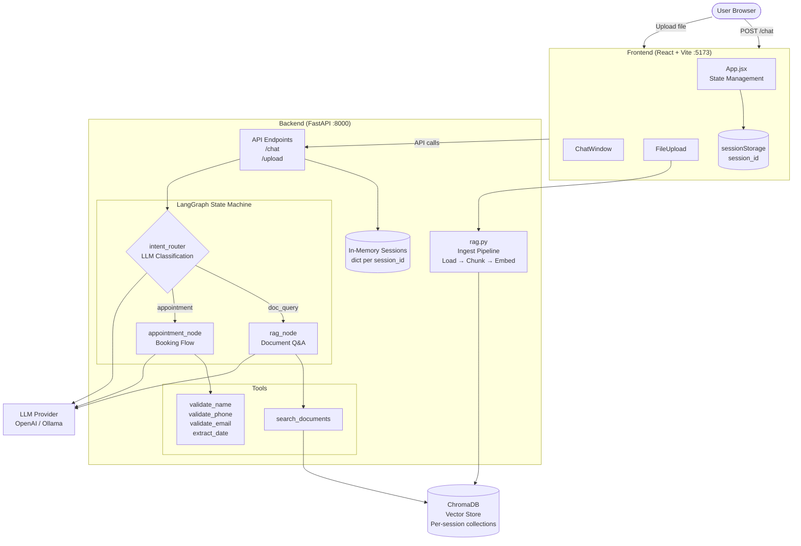

# Document Queries & Appointment Booking Chatbot

A chatbot that lets you upload documents and ask questions about them (RAG) or book appointments through a guided conversation flow. Built with FastAPI, React, LangGraph and Ollama/OpenAI.

## System Architecture



## How it works

- **Document Q&A**: Upload a PDF/TXT file, then ask questions. The system chunks and embeds the document using ChromaDB, then retrieves relevant context to answer your queries.
- **Appointment Booking**: Say "I want to book an appointment" and the bot walks you through collecting name, phone, email and date. Dates can be natural language like "next Monday" or "in two days" (handled by `dateparser`). All inputs are validated via LangGraph tools.
- **Context Switching**: You can ask a document question mid-appointment. The booking state is preserved and you can resume where you left off.

## Prerequisites

- Python 3.12+
- Node.js 18+
- Either an [OpenAI API key](https://platform.openai.com/api-keys) or [Ollama](https://ollama.ai) installed locally

If using Ollama, pull the required models:

```bash
ollama pull qwen2.5:1.5b
ollama pull nomic-embed-text
```

The `nomic-embed-text` model is always needed for document embeddings regardless of the LLM provider.

## Setup

### Backend

```bash
cd backend
pip install -r requirements.txt
```

Create a `.env` file (or use the existing one):

```
LLM_PROVIDER=openai
OPENAI_API_KEY=sk-your-key-here
OLLAMA_BASE_URL=http://localhost:11434
LLM_MODEL=gpt-4.1
EMBED_MODEL=nomic-embed-text
CHROMA_PERSIST_DIR=./chroma_db
CHUNK_SIZE=1000
CHUNK_OVERLAP=200
```

| Variable | Description |
|---|---|
| `LLM_PROVIDER` | `openai` or `ollama` |
| `OPENAI_API_KEY` | Your OpenAI API key (only needed when provider is `openai`) |
| `LLM_MODEL` | Model name. For OpenAI: `gpt-4.1`, `gpt-4.1-mini`, etc. For Ollama: `qwen2.5:1.5b`, `llama3.1:8b`, etc. |
| `OLLAMA_BASE_URL` | Ollama server URL (only needed when provider is `ollama`) |
| `EMBED_MODEL` | Ollama embedding model for RAG |
| `CHROMA_PERSIST_DIR` | Path to store ChromaDB data |
| `CHUNK_SIZE` | Document chunk size for splitting |
| `CHUNK_OVERLAP` | Overlap between chunks |

### Frontend

```bash
cd frontend
npm install
```

## Running

Start Ollama (needed for embeddings, and for LLM if using `ollama` provider):

```bash
ollama serve
```

Start the backend:

```bash
cd backend
uvicorn main:app --reload --port 8000
```

Start the frontend (in another terminal):

```bash
cd frontend
npm run dev
```

Open http://localhost:5173 in your browser.

## Project Structure

```
├── backend/
│   ├── main.py           # FastAPI endpoints (/chat, /upload)
│   ├── graph.py           # LangGraph state machine and nodes
│   ├── tools.py           # Validation tools (name, phone, email, date and doc search)
│   ├── rag.py             # Document ingestion pipeline
│   ├── config.py          # Environment config
│   └── requirements.txt
├── frontend/
│   ├── src/
│   │   ├── App.jsx        # Main app component
│   │   ├── App.css
│   │   └── components/
│   │       ├── ChatWindow.jsx
│   │       ├── MessageBubble.jsx
│   │       └── FileUpload.jsx
│   ├── index.html
│   ├── vite.config.js
│   └── package.json
└── README.md
```

## API

**POST /chat**

```json
{ "session_id": "abc", "message": "hello" }
→ { "response": "Hi! How can I help?", "appointment": null }
```

**POST /upload**

Multipart form with `session_id` and `file` fields.

```json
→ { "filename": "doc.pdf", "chunks": 42 }
```

## Tech Stack

- **Backend**: FastAPI, LangGraph, LangChain and ChromaDB
- **Frontend**: React and Vite
- **LLM**: OpenAI (gpt-4.1) or Ollama (qwen2.5:1.5b, llama3.1:8b, etc.)
- **Embeddings**: nomic-embed-text via Ollama
- **Date Parsing**: dateparser
